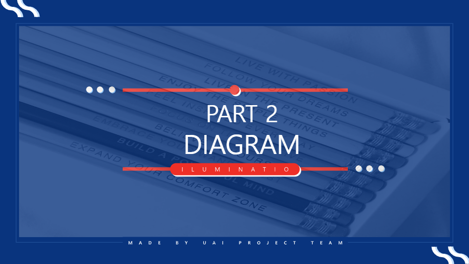

# UAI 프로젝트_강의교환 플랫폼

- 사용언어: CSS3, HTML, Java, JavaScript, SQL
- 업무포지션: 팀장
- 투입기간: 2019/07/30 → 2019/08/31

## 👩‍🏫활동 소개

Java기반 빅데이터 IT콘텐츠 정보시스템 취업과정에서 한 팀프로젝트

🗓️ **작업기간** : 2019.07.30 → 2019.08.31

👨‍💻 **투입인원** : 6명

📒 **주요업무** 

- 문제 기술서 작성 및 역할 분담
- 메인, 게시판, 관리자, 회원가입 및 로그인 페이지 화면 구현
- 세부 UI 디자인
- USE CASE DIAGRAM 작성

## 🖌️Details

